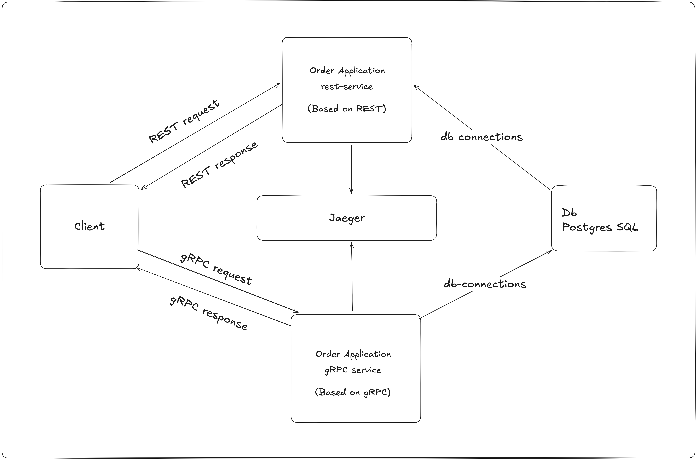

# REST vs gRPC - Implementing two versions of the same multi-service app using REST and gRPC to compare latency and observability.


## High Level Architecture



This project is an order management application that exposes the same functionality over both REST and gRPC, backed by a PostgreSQL database. The client can call either the REST-based or gRPC-based order service, which then communicates with the Postgres database over regular DB connections. Jaeger is integrated to trace and observe requests flowing between the client, the order services, and the database for distributed tracing and performance analysis

---

## Order Application - REST and gRPC

This document explains how to run, test, and debug the **Order Application** application consisting of:

- **Spring Boot API with REST (rest-service)** (Java)
- **Spring Boot API with gRPC (grpc-service)** (Java)
- **Postgres**
- **Jaeger**

---

This project demonstrates a **REST + gRPC multi service architecture** with **distributed tracing using Jaeger**, fully containerized using **Docker and Docker Compose**.

The setup allows you to:

- Run REST and gRPC services together
- Store the data in PostGreSQL Database
- Capture end-to-end traces using Jaeger
- Test CRUD operations using REST (curl) and gRPC (grpcurl)

---

## Tech Stack

- Java (Spring Boot)
- REST API
- gRPC
- OpenTelemetry Java Agent
- Jaeger
- PostGreSQL
- Docker & Docker Compose

---

## Prerequisites ✅

Make sure the following tools are installed:

- Docker (20+)
- Docker Compose (v2 recommended)
- Git
- (Optional) `grpcurl` for testing gRPC endpoints

---

## Chosen OSS/CNCF tool: **Jaeger**.

Jaeger is used as a distributed tracing system to collect, store, and visualize traces from the REST and gRPC services, enabling end‑to‑end request tracking, latency analysis, and troubleshooting in a cloud‑native, microservices‑style architecture.

## BUILD AND RUN THE APPLICATION

From the repository root:

```bash
# build & start (uses docker-compose.yml in repo root)
docker compose up -d --build

```
```bash
# confirm services
docker compose ps
```

Expected output:

```
CONTAINER ID   IMAGE                               COMMAND                  CREATED              STATUS              PORTS                                                                                                                                               NAMES
786a8eb10282   restgrpcjaegardocker-rest-service   "java -jar /app/app.…"   About a minute ago   Up About a minute   0.0.0.0:8080->8080/tcp, [::]:8080->8080/tcp                                                                                                         rest_service
ee9dd52a3415   restgrpcjaegardocker-grpc-service   "java -jar /app/app.…"   About a minute ago   Up About a minute   0.0.0.0:9090->9090/tcp, [::]:9090->9090/tcp                                                                                                         grpc_service
4ecec0de4127   postgres:15                         "docker-entrypoint.s…"   About a minute ago   Up About a minute   0.0.0.0:5432->5432/tcp, [::]:5432->5432/tcp                                                                                                         mds_postgres
066b31d64d69   jaegertracing/all-in-one:1.49       "/go/bin/all-in-one-…"   About a minute ago   Up About a minute   0.0.0.0:14250->14250/tcp, [::]:14250->14250/tcp, 0.0.0.0:14268->14268/tcp, [::]:14268->14268/tcp, 0.0.0.0:16686->16686/tcp, [::]:16686->16686/tcp   jaeger
```


## Testing CRUD Operations

This section demonstrates how to test CRUD operations for both **REST** and **GRPC** services once the stack is running via Docker Compose.

---

## REST API – CRUD Operations

**http://localhost:8080/orders**

### TEST THE SERVICE

```bash
curl http://localhost:8080/test
```

### CREATE (POST)

```bash
curl -X POST http://localhost:8080/orders \
  -H "Content-Type: application/json" \
  -d '{
        "product": "Widget",
        "quantity": 5
      }'
```

### READ ALL (GET)

```bash
curl http://localhost:8080/orders
```

### READ BY ID (GET)

```bash
curl http://localhost:8080/orders/{id}
```

### UPDATE (PUT)

```bash
curl -X PUT http://localhost:8080/orders/{id} \
  -H "Content-Type: application/json" \
  -d '{
        "product": "WidgetPro",
        "quantity": 10
      }'
```

### DELETE (DELETE)

```bash
curl -X DELETE http://localhost:8080/orders/{id}
```

## GRPC – CRUD Operations

gRPC server listens on port `9090` by default.

### Inspect available services

```bash
# list services
grpcurl -plaintext localhost:9090 list

# describe OrderService
grpcurl -plaintext localhost:9090 describe com.example.grpc.OrderService
```

### HelloService (basic check)

```bash
grpcurl -plaintext -d '{"name":"Grpc Service"}' localhost:9090 com.example.grpc.HelloService/SayHello
# Expected response:
# { "message": "Hello, Grpc Service" }
```

### Create order:

```bash
grpcurl -plaintext -d '{"product":"Widget","quantity":5}' localhost:9090 com.example.grpc.OrderService/CreateOrder
```

### List orders:

```bash
grpcurl -plaintext -d '{}' localhost:9090 com.example.grpc.OrderService/ListOrders
```

### Get order (example id 5):

```bash
grpcurl -plaintext -d '{"id":5}' localhost:9090 com.example.grpc.OrderService/GetOrder
```

### Update order:

```bash
grpcurl -plaintext -d '{"orderId":5,"product":"WidgetPrime","quantity":10}' localhost:9090 com.example.grpc.OrderService/UpdateOrder
```

### Delete order:

```bash
grpcurl -plaintext -d '{"id":5}' localhost:9090 com.example.grpc.OrderService/DeleteOrder
```

Notes:

- Use `-plaintext` when the server is unsecured (default in local compose setup).
- The server's proto file is `src/main/proto/index.proto`.
- If you don't have `grpcurl` on your host, you can run it inside a container:

```bash
docker run --rm --network host fullstorydev/grpcurl -plaintext localhost:9090 list
```

### Troubleshooting

- If `grpcurl` reports connection refused, ensure the gRPC container is running and port `9090` is exposed in `docker compose ps`.
- If DB-dependent operations fail during tests locally, either start the `postgres` service from compose or run tests that use an in-memory DB.

## 🔧 Trace demo scripts & comparing traces using Jaegar(quick start)

- **Generate one trace per endpoint**

  - Use the helper script to exercise every REST and gRPC endpoint and create a trace for each:

  ```bash
  # example: creates traces with demo id prefix 'demo-run'
  ./scripts/trace-per-endpoint.sh demo-run
  ```

  - The script prints a **summary** mapping each call label (e.g., `create-order-grpc`) to the trace id(s) produced by Jaeger.

- **How to find traces in Jaeger UI**

  - Open Jaeger UI: http://localhost:16686
  - Search by service name (`grpc-service` or `rest-service`) and use the **Tag** field with `demo.id` to filter. Example:
    - `demo.id=demo-run-create-order-grpc-*` (search supports wildcards in the UI tag input)

- **Compare two traces in Jaeger UI**

  1.  Search and locate the two traces you want to compare.
  2.  Check the boxes on the left of each trace (exactly two must be selected).
  3.  Click the **Compare** button that appears near the top of the search results.
  4.  The compare view shows traces side-by-side with span timelines; click individual spans to inspect tags (look for `demo.id`) and timestamps.

  Notes:

  - If the compare view is blank, ensure both traces have application/server spans (not only DB/jdbc spans) and that `demo.id` exists on the spans you expect to compare. Reload the UI or try a different browser if the UI fails to render.

## Auto-instrumentation with Jaeger (OpenTelemetry Java agent)

Follow these steps to quickly enable tracing and view traces in Jaeger:

1. Download the OpenTelemetry Java agent into the repository root:

```bash
curl -sSL -o opentelemetry-javaagent.jar \
	https://github.com/open-telemetry/opentelemetry-java-instrumentation/releases/latest/download/opentelemetry-javaagent.jar
```

2. Bring up the stack (the Compose file is already configured to mount the agent and start Jaeger):

```bash
docker compose up -d --build
```

3. Open Jaeger UI at: http://localhost:16686 and search for `grpc-service` or `rest-service` to view traces.

Notes:

- The Docker Compose file mounts `./opentelemetry-javaagent.jar` into both services and sets OTEL environment variables. Make sure the file exists at the repo root before `docker compose up`.
- For demo purposes the sampler is set to `always_on` so traces will always be exported to Jaeger.

---

## REST vs gRPC – Distributed Tracing Comparison (Jaeger)

We implemented the same **Create Order** functionality using:
- REST (HTTP/JSON)
- gRPC (HTTP/2 + Protobuf)

Both services:
- Share the same PostgreSQL database
- Use Spring Boot and Spring Data JPA
- Execute identical business logic

### Jaeger Trace Comparison – Create Order


### Observations

| Aspect | REST | gRPC |
|------|------|------|
| Protocol | HTTP/1.1 | HTTP/2 |
| Payload | JSON | Protobuf (binary) |
| Avg Latency | ~52 ms | ~8 ms |
| DB Operations | Same | Same |
| Spans | 6 | 6 |

### Analysis

Although both implementations perform the same database operations, the gRPC-based service consistently shows lower latency. This is primarily due to:

- Binary serialization (Protobuf)
- Reduced payload size
- Efficient multiplexing via HTTP/2
- Lower framework overhead compared to REST + JSON

This comparison demonstrates how protocol choice alone can significantly impact performance in distributed systems.


